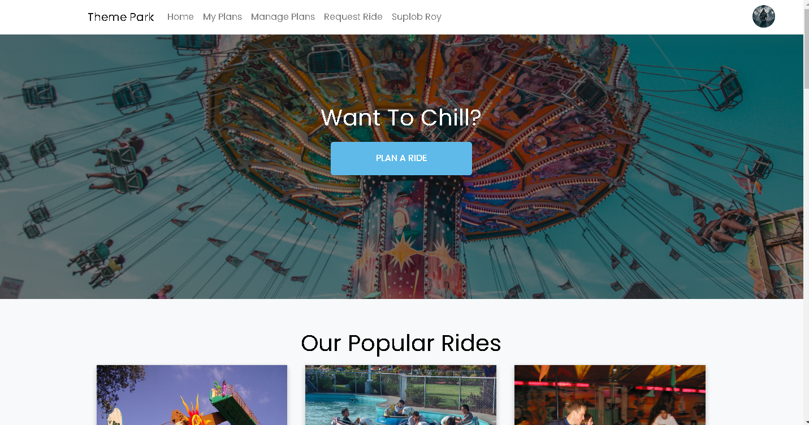
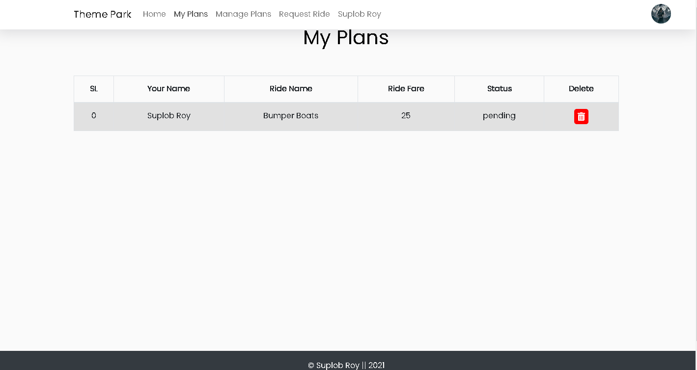
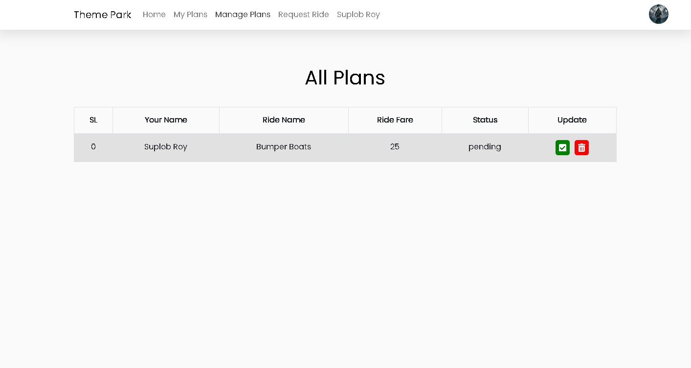
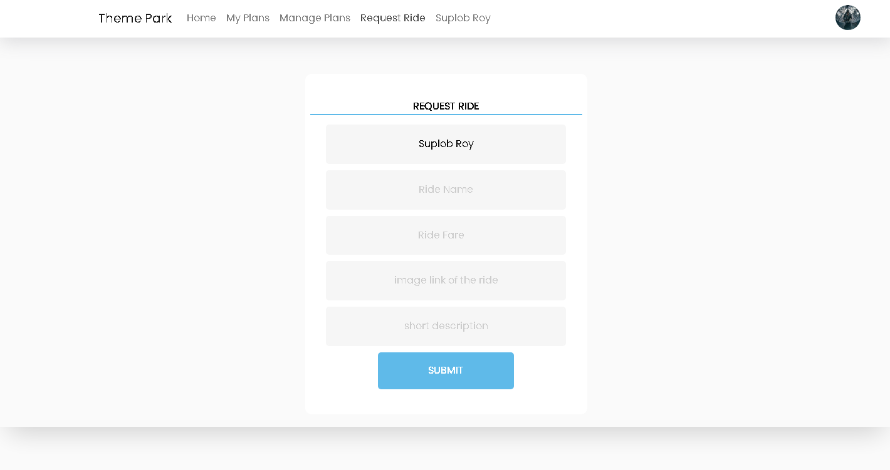

# Theme Park

Link to [live site](https://theme-park-bac35.web.app/home)
Link to [backend code](https://github.com/Suplob/themepark-server)

A complete full stack responsive website with CRUD operations made with ReactJS and MongoDB. Used Firebase authentication to handle authentication.









## Tech Stack

- ReactJS
- React Router
- MongoDB
- Bootstrap
- React Hook Form
- Firebase Authentication
- NodeJS
- ExpressJS

## How to clone this repository

```
    git clone https://github.com/Suplob/themepark-client.git
    cd themepark-client
    npm i
```
